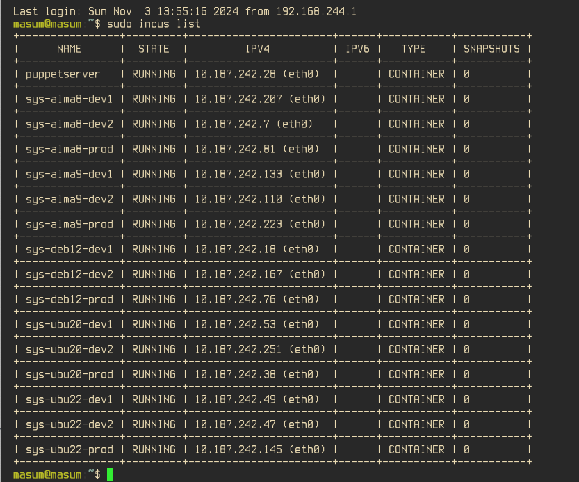

# infrastructure

1. First setup ssh with your all hosts without asking password.
`ssh-copy-id` can be an easy fix.

2. If you have automated image creation script like packer or so you can
   add user public key in user's home directory.

3. Copy ansible_install.py script at target node and install ansible it.

4. Copy sudo.yml to target host and run this playbook to give user admin priviledge.

5. Edit all related variables in host_vars,group_vars and hosts.yml accordingly.

6. Run housekeeping.yml playbook.

7. Run puppetcluster.yml to set up puppet master and agent if the node is freebsd.

8. Run saltcluster.yml to install salt-master and salt-minion nodes. if the node is Ubunut/Centos.

9. Run r10k.yml to install r10k in puppetmaster.

10. Run deployment.yml to deploy environment in agent nodes.

11. Run saltcluster.yml to install salt-master and salt-minion nodes.

12. Run lxd.yml to install lxd package through snap.

13. ssh to the node. run cd to change to home directory.Run `sudo lxd init` manually in all nodes. Currently we have only 3 compute nodes in this cluster. Therefore It will be easier for us to initial lxd this way.When we have many compute nodes we can think of preseed and and using certificate inpreseed.

14. Run quagga.yml against compute nodes.
update all router-id in bgpd.conf file

15. SideNote: How to remove lxd service from a node.
    ```
    sudo lxc list
    sudo lxc stop <lxd_container_name>
    sudo lxc delete <lxd_container_names>
    sudo zfs list
    sudo zfs destroy -r <pool_name>
    sudo zpool list
    sudo zpool destroy -f <pool_name>
    sudo lxd cluster remove -f <node_name>
    sudo snap remove lxd
    ```

##  lxd container specific

1. install python on target node.

1. copy ansible_install.py to target node.

   curl -O https://raw.githubusercontent.com/masumndc1/infrastructure/master/ansible_install.py

2. copy pkg_srv.yml to target node and run. to install pkg and service and etc

   curl -O https://raw.githubusercontent.com/masumndc1/infrastructure/master/pkg_srv.yml

   curl -O https://raw.githubusercontent.com/masumndc1/infrastructure/master/lxd_bootstrap.sh

4. run hosts.yml against the node to let target machine knows about all the nodes in infra


3. run saltcluster.yml against lxds nodes

## Infra pics

